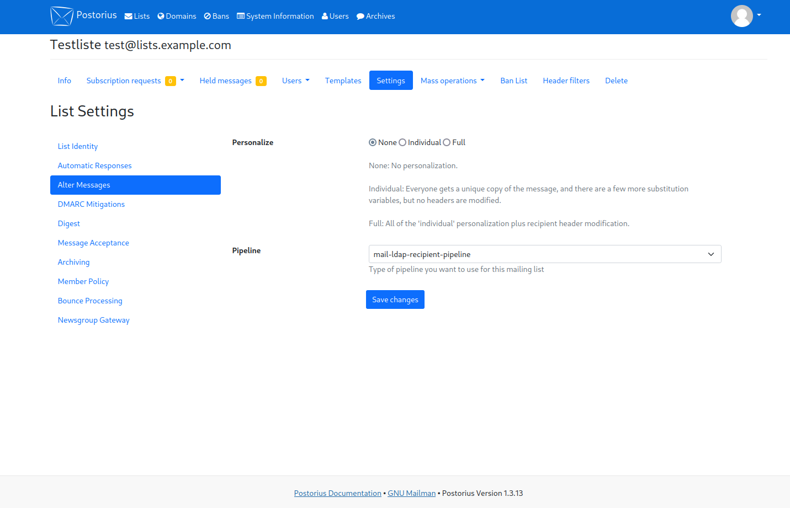

# Mailman LDAP Members Plugin

This is a Mailman Plugin that enables you to have list members derived from an LDAP
group.

However, there are a few caveats: 
- You won't see the LDAP Members in the Member list
- LDAP Members can't have any special settings like digests, language etc.
- LDAP Members can't unsubscribe
- LDAP Members are constraint to the default member-processing Action. No custom action/posting privileges per user
- Bounce Processing for LDAP Members will likely not work

## Configuration
In `/etc/mailman/mailman.cfg` add
```ini
[plugin.mailman_ldaprecipient_plugin]
class: mailman_ldaprecipient_plugin.plugin.LdapRecipientPlugin
enabled: yes
configuration: /etc/mailman/ldap.cfg
```
And in `/etc/mailman/ldap.cfg`
```ini
[ldap]
ldap_uri: ldap://ldap.example.com
ldap_port: 389
; only read permissions are required for membership and name attributes
; so don't actually use a root user
ldap_bind_dn: cn=root,dc=example,dc=com
ldap_bind_pass: password
ldap_group_base: ou=groups,ou=members,dc=example,dc=com
ldap_user_base: ou=users,ou=members,dc=example,dc=com
ldap_tls_cert: /path/to/root_ca.pem
ldap_starttls: True

; the ldap attribute that has the list e.g. for list test@lists.example.com
; the attribute would need to have test.lists.example.com
; if you don't want to create your own schema, use something like 'description'
ldap_listid_attr: listId
ldap_user_mail_attribute: mail
```

example LDAP schema
```schema
attributetype ( 1.3.6.1.4.1.47955.1.1.1.1.16
    NAME 'listId'
    DESC 'Mailing List-ID for the Group, that is matched in Mailman'
    EQUALITY caseIgnoreMatch
    SUBSTR caseIgnoreSubstringsMatch    
    SYNTAX 1.3.6.1.4.1.1466.115.121.1.44
    )
objectclass ( 1.3.6.1.4.1.47955.1.1.1.2.7
    NAME 'mailinglist'
    DESC 'A Group that has an associated mailing list in Mailman'
    SUP top AUXILIARY
    MUST ( listId )
    )
```

## Mailman List Settings
For LDAP Members to receive emails you need to select the 'mail-ldap-recipient-pipeline'
in the Alter message tab of the Mailing list
